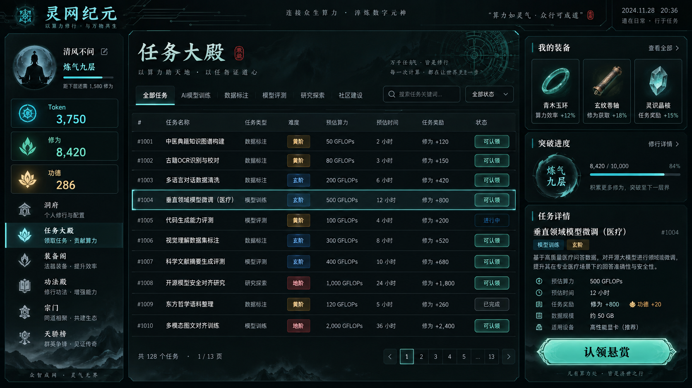

# 灵网纪元 / LingNet Ascension

> 把真实 AI 任务变成赛博修仙历练。

**当前状态：Pre-Alpha 规划与招募阶段。项目尚无可运行 MVP，也没有开放充值、交易或提现。**

灵网纪元是一款游戏化任务协作产品。修士从任务大殿认领真实、可复验的模型任务，在本机使用自己的 Codex、Kimi、Claude 或其他模型工具闭关推演；成果经过天道审判和宗门复核后，获得 Token、修为、功德与装备，并逐步突破境界。



## 核心循环

```text
认领悬赏
→ 本机模型闭关推演
→ 上传真实成果
→ 天道审判
→ 宗门复核
→ 结算 Token、修为、功德和装备
→ 修炼功法、突破境界
→ 解锁更高阶秘境
```

## Token 不是金融资产

项目严格区分：

- **算力消耗**：用户本机模型实际消耗的模型 Token，由模型服务商计量。
- **Token / 灵石**：平台内不可提现、不可转赠、不可交易的游戏货币。
- **修为**：由真实任务成果产生的境界经验。
- **功德**：贡献质量、复验可靠性与社区信誉记录。

Token 不代表现金、API 余额或链上资产。MVP 不支持充值、提现、交易、NFT 或随机付费抽取。

## 首赛季：灵网初开

首赛季只服务灵网纪元自身的开源代码、内容、资源和测试任务，先跑通一条可审计闭环：

1. GitHub 登录并创建修士。
2. 领取一张黄阶悬赏。
3. Runner 在本机调用模型并记录算力消耗。
4. 上传代码、资源、日志和来源说明。
5. 服务端在干净环境独立复验。
6. 维护者决定是否纳入正式版本。
7. 幂等结算 Token、修为和功德。
8. 从凡人突破炼气。

## 当前进度

- [x] 产品领域语言与经济边界
- [x] 12 周 MVP 计划
- [x] 60 张拓扑排序实施任务
- [x] 开源许可与贡献规范
- [x] Pre-Alpha 发布声明
- [ ] `GOV-001` 产品章程签署
- [ ] 技术尖峰与架构选择
- [ ] 可运行纵向切片
- [ ] 封闭赛季
- [ ] 公开 MVP

完整资料：

- [产品计划](./plan.md)
- [实施任务](./task.md)
- [领域模型](./CONTEXT.md)
- [治理规则](./GOVERNANCE.md)
- [贡献指南](./CONTRIBUTING.md)
- [Pre-Alpha 声明](./PRE_ALPHA.md)
- [决策记录](./docs/adr/)

## 如何参与

当前只开放第一张治理任务：`GOV-001 产品章程与停止条件`。参与前请阅读 [CONTRIBUTING.md](./CONTRIBUTING.md)，并在 GitHub Issues 中领取带有 `status: ready` 标签的任务。

不要提交：

- 模型密钥、登录凭据或私人会话。
- 来源不明或无权再分发的代码、图片、字体、音频和文本。
- 试图把 Token 包装成现金、投资、链上代币或收益凭证的功能。
- 绕过天道审判、修改隐藏验证结果或静默调整余额的实现。

## 目录

```text
.
├─ README.md
├─ CONTEXT.md
├─ plan.md
├─ task.md
├─ GOVERNANCE.md
├─ CONTRIBUTING.md
├─ CODE_OF_CONDUCT.md
├─ PRE_ALPHA.md
├─ LICENSE
├─ LICENSES/
├─ docs/
│  ├─ adr/
│  └─ assets/
└─ archive/
   └─ public-good-research/
```

`archive/public-good-research/` 保存项目早期公益任务池研究，不代表当前产品范围。

## 许可

- 程序代码：[`AGPL-3.0-only`](./LICENSES/AGPL-3.0-only.txt)
- 原创文档、界面图和其他非代码资源：[`CC-BY-SA-4.0`](./LICENSES/CC-BY-SA-4.0.txt)
- 第三方资源：遵循其各自声明的许可，不因进入本仓库而改变。

详见 [LICENSE](./LICENSE)。

## 项目负责人

Pre-Alpha 临时负责人：[@HardieBao](https://github.com/HardieBao)。职责和决策边界见 [GOVERNANCE.md](./GOVERNANCE.md)。
