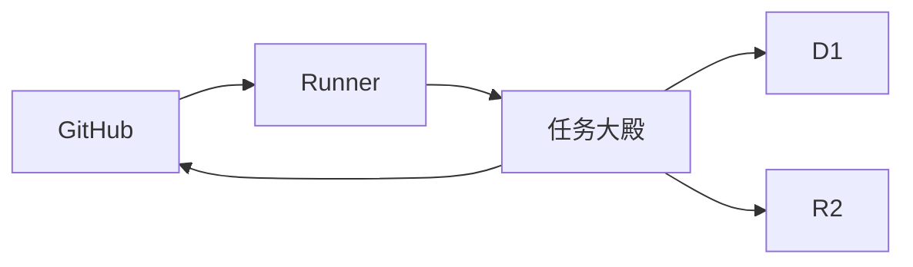

# GOV-003 技术尖峰与架构决策（自动测试模拟样本）

本文件仅供验证结构检查与任务范围，所有命令输出和证据均为模拟文本，不是实际贡献、真实 CI 记录或真人复核结论。真实投稿者必须独立重跑并提供可核验链接。

## 固定基线与执行环境

固定基线：35802fe8167c5a24e8d66787d14b984aa1da3aa5。执行环境：Windows、Node.js 24、Git 与本机 Codex CLI；执行时间：2026-09-24 07:00 UTC。测试从干净检出开始，不读取或上传任何账户密钥，模型 Token 与游戏 Token 分别记录。

## 模拟悬赏纵向流程

先以修士账号认领黄阶模拟任务，核对任务包基线和租约；随后用 Runner 在隔离工作区调用本机模型。成果只修改任务允许的 Markdown 文件，再通过页面上传。天道审判执行结构检查，宗门维护者独立复核内容与来源；只有审查文件实际合入 GitHub 主分支并且摘要相同时，才称正式成果。最后检查 Token、修为、功德账本三项入账和押金解冻，重复回调不能重复奖励。此段是流程说明，不声称测试样本已经在远端执行。

## 验证命令、命令输出与 CI 证据

在站点目录执行 `npm test`、`npm run typecheck`、`npm run lint`、`npm run build`。命令输出在正式报告中应附退出码、时间、运行环境和完整日志链接；CI 证据应给出可信基线工作流的提交及运行链接，并指出失败或跳过的检查。这里没有提供真实输出，维护者不得把这份模拟样本当作通过记录。

## 架构图

Runner 只接触本机登录状态，D1 保存任务和经济事件，R2 保存上传的成果文件；GitHub 主分支提供正式合入证据。部署环境与模型凭据隔离，不能把本机实际模型费用写进游戏余额。

## 方案对照与技术评分

方案 A：维持浏览器任务大殿、D1/R2 和本机 Runner 的分层，优点是账户数据由服务端核验，缺点是本机模型用量缺少可信硬封顶。方案 B：把所有生成都放在托管执行环境，优点是更容易统一日志，缺点是平台必须托管模型密钥并承担较高安全与费用责任。权衡安全边界、维护成本、可复验性和用户费用后，技术评分：82。这个数字只是测试样本的结构值，正式提交需附逐维度的可审查评分表。

## ADR：保留本机生成、独立服务端验收

选择方案 A 的理由是避免托管私人模型密钥，保持用户可控；风险是 Runner 无法证明每次推演的真实 Token 硬预算，且结构检查不能证明用户访谈或代码正确性。回滚策略是在账本异常或凭据事件出现时暂停新认领、保留事件并用抵消记录修复，不删除历史。未验证项包括生产 GitHub 登录、公开仓库 CI、真实多人复核、长期费用上限和正式环境中 R2 故障恢复。下一步需由维护者在干净环境复现关键步骤并补齐真实证据。
